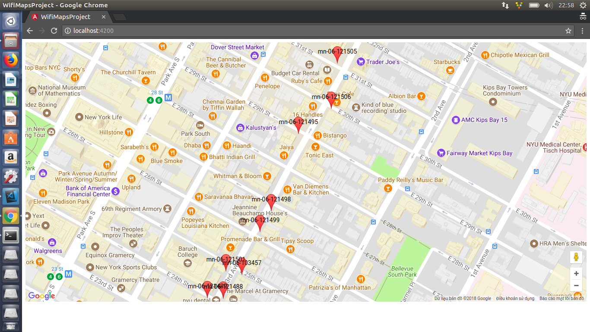

- Import importDB.txt to Cassandra DB
- Start backend: Golang

    start cassandra database

    cd data-stream-backend
    
    go run main.go

 API:
| Api                | Method        |
| ------------------ | :-----------: |
| /get-all-wifi      | GET           |
| /post-all-wifi     | POST          |

- Start frontend: Angular 4
    
    cd wifi-data-client
    
    npm i
    
    ng s

- http://localhost:4200

